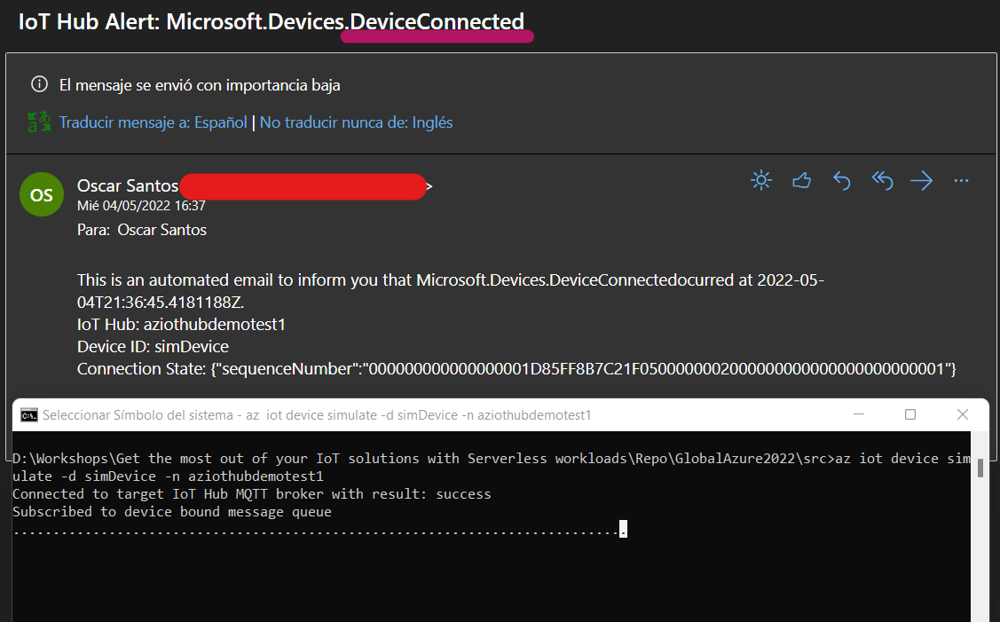
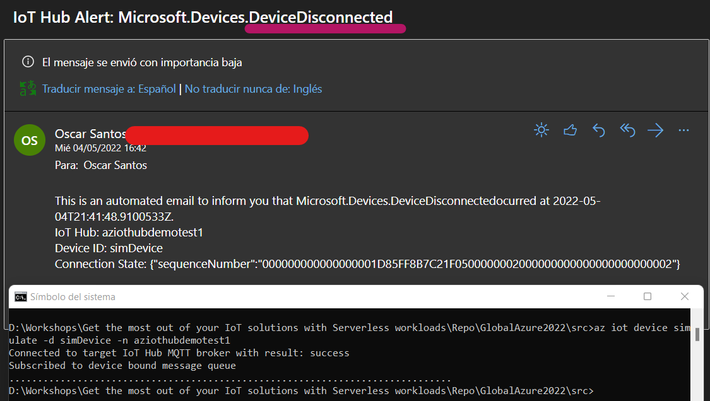

# Get the most out of your IoT solutions with Serverless workloads

> Workshop at [Global Azure 2022](https://globalazure.net/sessions/338038)

With the use of IoT, device management and monitoring processes have become simpler. However, traditional infrastructure has drawbacks for this type of solution, so if either the device or remote server goes down, data is lost or, worse, accidents can occur. With cloud technologies this is not longer a problem. With serverless design patterns engineers can be alerted when devices go offline or when there is an anomaly in a measured value. In addition, no data is lost during an outage as all data is saved in cloud storage.

## Software and Tools used during the workshop

* [VSCode](https://code.visualstudio.com/)
* [Azure subscription](https://azure.microsoft.com/en-us/)

## Steps

### Create an IoT Hub from the Azure Cloud Shell

Create a resource group

```
az group create --name {your resource group name} --location westus --tags "Environment=workshopdemo"
```

Create the IoT Hub

```
az iot hub create --name {your iot hub name} --resource-group {your resource group name} --sku S1
```

### Create an Azure Logic App with a HTTP Trigger

Clone the repo  
```
git clone https://github.com/OscarSantos98/GlobalAzure2022.git
cd GlobalAzure2022/src/
```

Add the Azure Logic Apps CLI extension  
```
az extension add --name logic
```

Create the Logic App
```
az logic workflow create --resource-group {your resource group name} --location "westus" --name {your logic app name} --definition "BlankDefinition.json" --tags "Environment=workshopdemo"
```

**Select a trigger**

Select in the connectors  
*Request - When an HTTP request is received*

Select *Use sample payload to generate schema* and paste the following.
```
[{  
   "id": "f6bbf8f4-d365-520d-a878-17bf7238abd8",
   "topic": "/SUBSCRIPTIONS/<subscription ID>/RESOURCEGROUPS/<resource group name>/PROVIDERS/MICROSOFT.DEVICES/IOTHUBS/<hub name>",
   "subject": "devices/LogicAppTestDevice",
   "eventType": "Microsoft.Devices.DeviceConnected",
   "eventTime": "2018-06-02T19:17:44.4383997Z",
   "data": {
       "deviceConnectionStateEventInfo": {
         "sequenceNumber":
           "000000000000000001D4132452F67CE200000002000000000000000000000001"
       },
     "hubName": "egtesthub1",
     "deviceId": "LogicAppTestDevice",
     "moduleId" : "DeviceModuleID"
   }, 
   "dataVersion": "1",
   "metadataVersion": "1"
 }]
```

**Create an action**

1. Search for Outlook.com and choose Send an email (V2) action

2. Sign in and select yes to authorize the app

3. Build your email template

* To: use an email account that you can access, you will receive notifications there.
* Subject: Dynamic content -> IoT Hub alert: {eventType}
* Body: Write the text for your email. Select JSON properties from the selector tool, also click on more in the Dynamic content screen.
* Save

**Example**


> IoT Hub Alert: *eventType*  
This is an automated email to inform you that *eventType* ocurred at *eventTime*.  
IoT Hub: *hubName*  
Device ID: *deviceId*  
Connection State: *deviceConnectionStateEventInfo*  

**Copy the HTTP URL**

Save the URL that your app is listening to, it will be used with EventGrid later.
That one should look like this  

```
https://prod-45.westus.logic.azure.com:443/workflows/eaeae928fe6544749a9663035dbb3d24/triggers/manual/paths/invoke?api-version=2016-10-01&sp=%2Ftriggers%2Fmanual%2Frun&sv=1.0&sig=ixKhf59swFN53w2kbjb72fVrR6R7kMEhcu3jgfDuhg4
```

### Configure subscription for IoT Hub events

1. Go to your IoT Hub resource and click on Events in the left-pane.  

2. Create an Event Subscription with a name and Event Grid Schema as schema.

3. Define a name for your topic.

4. Select only Device Connected and Device Disconnected.

5. Select Webhook in the endpoint details section as endpoint type.

6. In the select an endpoint, paste the URL from your HTTP Trigger of the Logic App.

7. Create

Note: If you get an error you must register EventGrid in your subscription  
Go to your subscription and register it as shown in the image or use Cloud Shell instead.


### Simulate a new device

With Azure Cloud Shell  
```
az iot hub device-identity create --device-id simDevice --hub-name {YourIoTHubName}
```

Simulate device  
```
az iot device simulate -d simDevice -n {YourIoTHubName}
```



And after execution of the simulation

